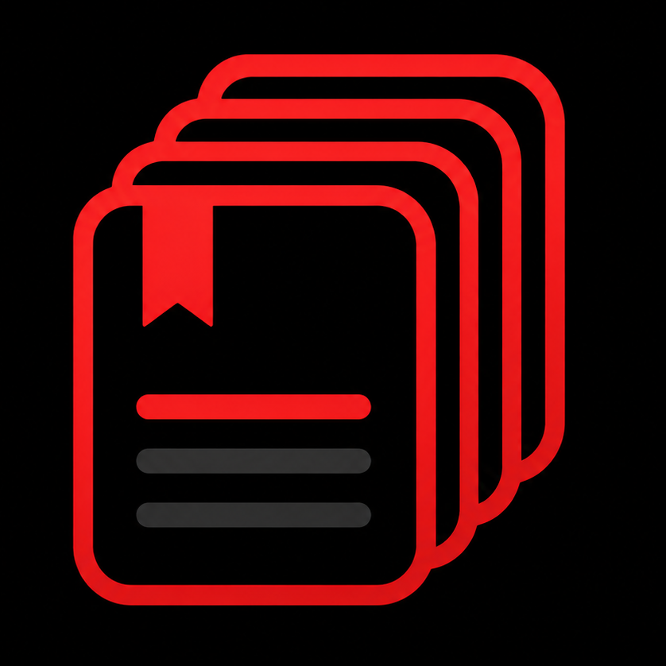

<p align="center">
  
</p>

<h1 align="center">PaperQueue</h1>

<p align="center"><i>Read more of your Zotero library, with less friction.</i></p>

PaperQueue is a native **iOS · iPadOS · macOS** app (SwiftUI) that turns your
[Zotero](https://www.zotero.org) library into a **focused, curated reading
queue**. Zotero is great for organizing references, but not for the daily flow
of *"what do I read today?" → "read it" → "next."* PaperQueue is built for that.

> **Serverless by design.** The app talks **directly** to the Zotero Web API
> (or your local Zotero) — there is no backend to run. Queue state lives in
> Zotero **tags**, so it syncs across your devices automatically.

## Features

- **Reading queue** — a curated list of papers you actually intend to read.
  Swipe to mark read, postpone, skip, or remove. Drag to reorder.
- **Library** — browse your whole library with **search** and **filters**
  (All / In Queue / Unread / Read, and **by collection**).
- **Collections** — navigate collections and subcollections and add papers to
  the queue from there.
- **Add by DOI** — fetches metadata from Crossref and adds the paper to Zotero.
- **History** — everything you've read, with real read dates.
- **Stats** — reading streak, papers read per week, totals.
- **Widget** — pending count and the next paper, one tap to open.
- **Offline-first** — a local SwiftData cache + an outbox that syncs tag
  changes back to Zotero when you're online.

The companion split: **iPhone/iPad** manage the queue (mark read, build queues,
search, add). **Mac** is where you read — it opens the PDF in Zotero.

## How state is stored (Zotero tags)

PaperQueue keeps its state in namespaced Zotero tags, so it's portable and
syncs through Zotero itself:

| Tag | Meaning |
| --- | --- |
| `pq:queue` | The paper is in the reading queue |
| `pq:pos:<n>` | Position in the queue (gapped, so reordering is cheap) |
| `pq:read:<YYYY-MM-DD>` | Read, with the real read date (multi-device stats) |
| `pq:skip` | Skipped |

These are easy to find and remove in Zotero if you ever stop using the app.

## Data sources

- **Web (any device):** sign in with a personal **Zotero API key**
  ([create one here](https://www.zotero.org/settings/keys/new) with library
  read & write). Works anywhere; needs Zotero Web sync enabled for your library
  metadata. Queue/read tags sync across devices.
- **Local (Mac / same network):** *"Use Zotero on this Mac"* reads your local
  Zotero library directly (all files included, no web sync) and opens PDFs in
  Zotero. Requires Zotero to be open.

Your API key is stored only in the device **Keychain** and sent as the
`Zotero-API-Key` header — it is never hardcoded, logged, or placed in URLs.

## Install

### macOS (`PaperQueue.dmg`)
Download from [Releases](https://github.com/Drakonis96/paperqueue/releases),
open the DMG and drag PaperQueue to Applications. The build is **unsigned**, so
the first launch: **right-click → Open**.

### iOS/iPadOS (`PaperQueue-unsigned.ipa`)
The IPA is **unsigned** (a device-installable IPA needs Apple Developer
signing). Two options:
- **AltStore / SideStore** — add the source and install (re-signs with your
  Apple ID):
  ```
  https://raw.githubusercontent.com/Drakonis96/paperqueue/main/altstore-source.json
  ```
- **Xcode** — open the project, set your Team under *Signing & Capabilities*,
  and Run on your connected device.

## Build from source

Requirements: macOS with **Xcode 26+**, [XcodeGen](https://github.com/yonghuang/XcodeGen)
(`brew install xcodegen`).

```bash
cd app
xcodegen generate            # creates PaperQueue.xcodeproj from project.yml
open PaperQueue.xcodeproj     # or build from the command line:

# iOS Simulator
xcodebuild -project PaperQueue.xcodeproj -scheme PaperQueue \
  -destination 'platform=iOS Simulator,name=iPhone 16 Pro' build

# macOS
xcodebuild -project PaperQueue.xcodeproj -scheme PaperQueue \
  -destination 'platform=macOS' build
```

The Xcode project is generated from `app/project.yml` (not committed) — edit
the YAML and re-run `xcodegen generate`.

## Project structure

```
PaperQueue/
├── app/                       # SwiftUI app (iOS + macOS) — the product
│   ├── project.yml            # XcodeGen project definition
│   ├── PaperQueue/            # app sources (App, Auth, Networking, Persistence, Features…)
│   ├── PaperQueueWidget/      # WidgetKit extension
│   └── Shared/                # code shared with the widget (App Group snapshot)
├── server/                    # legacy Fastify+SQLite backend — NOT used (serverless app)
├── altstore-source.json       # AltStore/SideStore source
└── logo.png
```

> `server/` was an earlier OAuth-broker design. The app is now serverless, so
> it's kept only for reference / a possible future web client.

## License

MIT — see [LICENSE](LICENSE).
